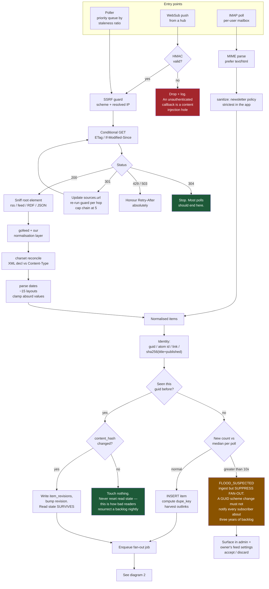
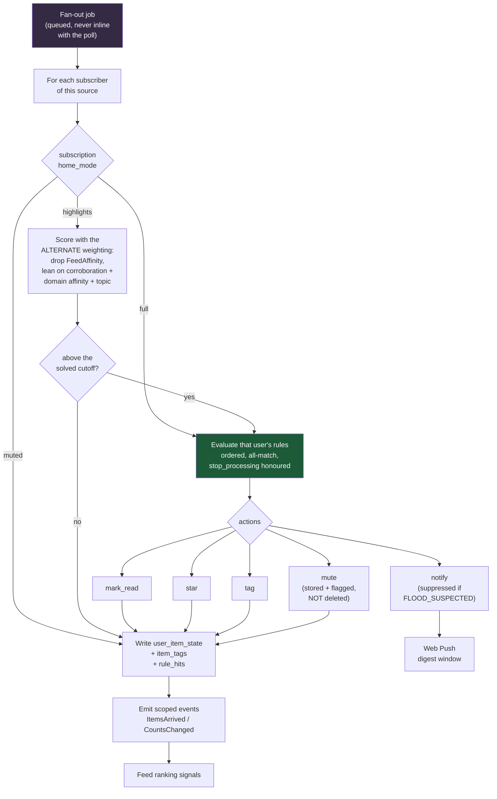
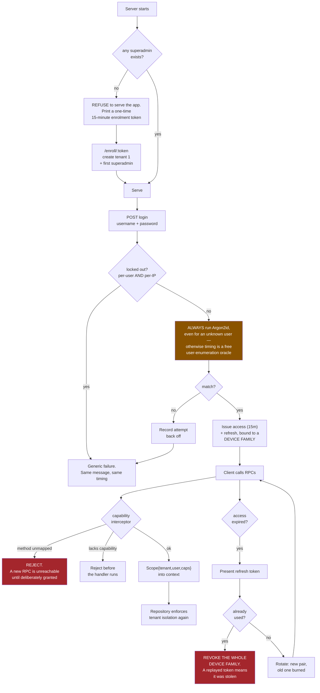
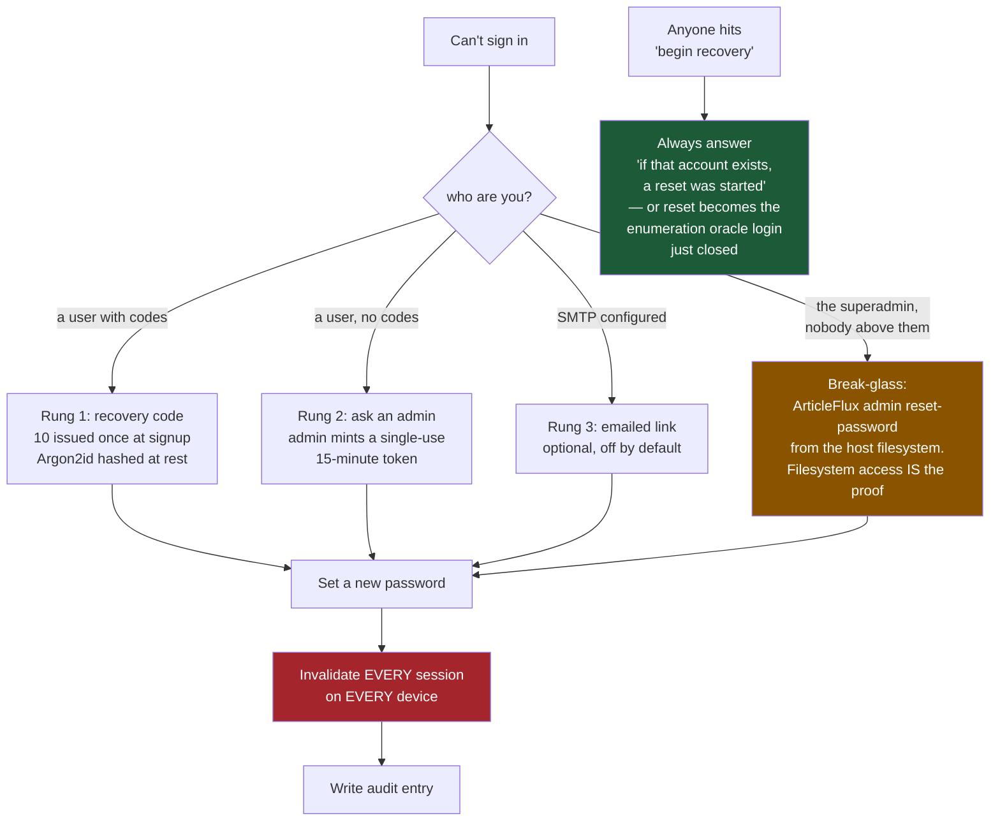
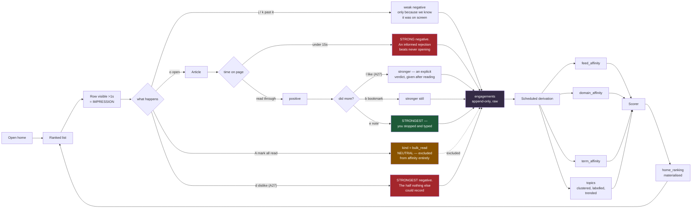
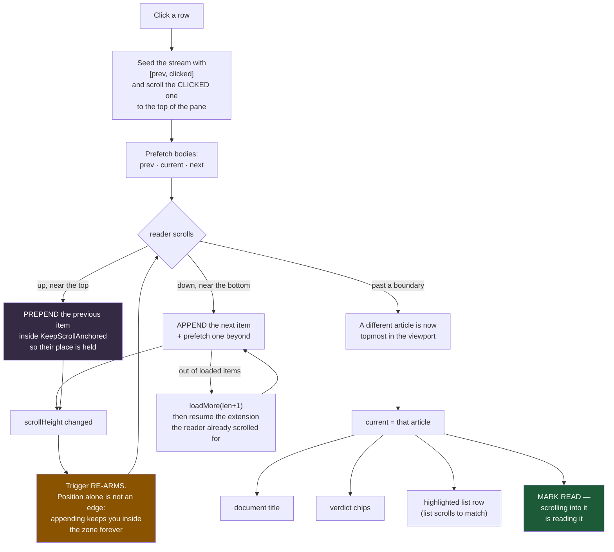
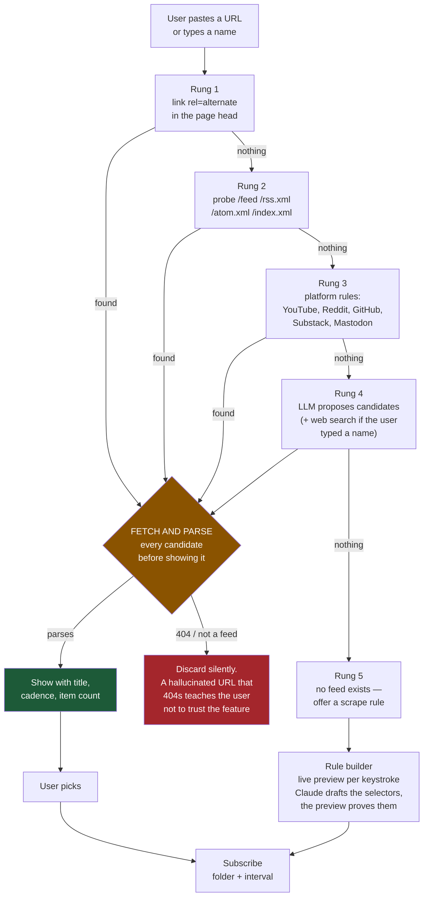
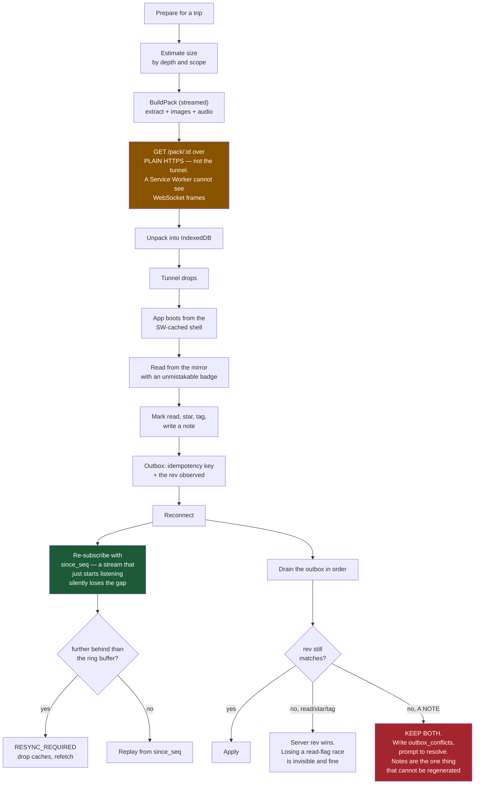
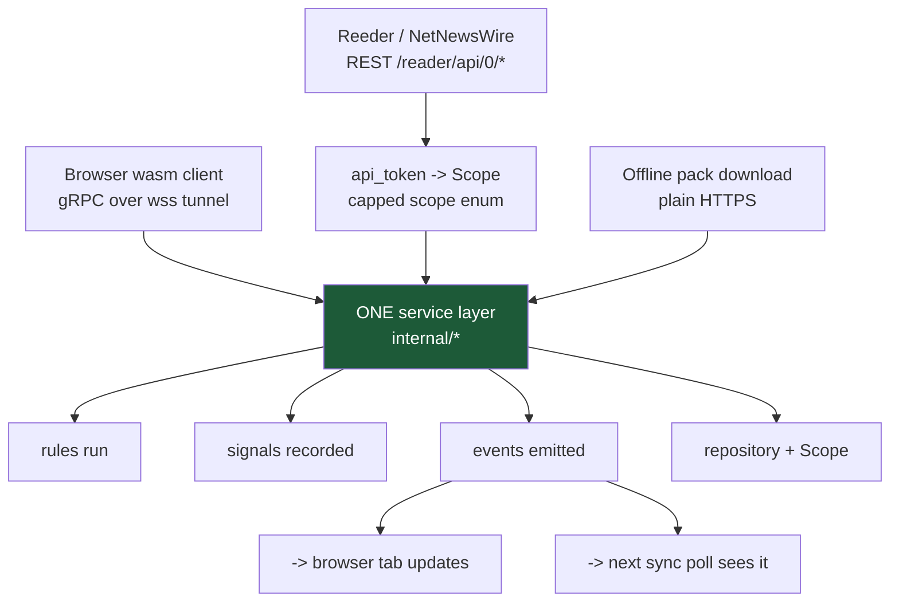
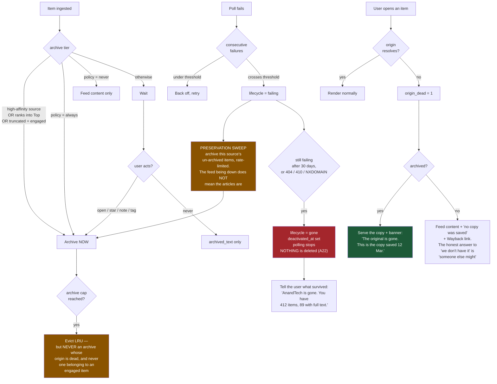

# ArticleFlux — flows

*Companion to `plan.md` (rev 8) and `TODO.md`. Mermaid — renders in VS Code preview, GitHub, and most
markdown viewers.*

These exist because three things in this design are easy to get subtly wrong in ways that don't throw
errors: **fan-out happens per subscriber, not per item** (§2); **refresh-token reuse must revoke a
family, not a token** (§3); and **bulk reads must not reach the interest model** (§5). Each is drawn
so the wrong version is visibly wrong.

> **Document set:** `plan.md` is the spec of record; `TODO.md` owns build order; **this file owns the
> behaviour of the paths below and nothing else.** If a diagram and `plan.md` disagree, `plan.md`
> wins. Every diagram cites the section it draws and the `T#` test that pins it — see the table at
> the end.

---

## 1. Feed ingestion — three entry points, one pipeline

**The two green boxes are the common case.** A healthy poll ends at `304`, and a re-serve of unchanged
content ends at "touch nothing." If either is doing work, something is wrong.

---

## 2. Fan-out — per subscriber, off the poll thread

The single subtlest thing in the design. `items` are **global** (A14), rules are **per user**, so
evaluating once at ingest means one person's mute filter hides an item from everyone.

> **Cost:** `O(new_items x subscribers)`. A source with 200 subscribers returning 50 items is 10,000
> evaluations — which is exactly why this is a queued job with per-kind concurrency caps and not
> something the fetch loop waits on.

---

## 3. Authentication — bootstrap, login, session lifetime

**Third-party sync clients** take the same path with one difference: an `api_tokens` bearer resolves to
the same `Scope`, but its capability set is a **fixed enum** (`reader_ro` / `reader_rw`) that can never
inherit the owner's admin capabilities. A token pasted into a phone app is the worst possible place for
`system.impersonate` to leak.

---

## 4. Recovery — three rungs, none of them billed

---

## 5. The reading loop — and how it feeds the ranker

The loop that has to be right, because it runs hundreds of times a day and quietly trains everything.

> **The dotted line is the whole point.** One `mark all read` is 143 items; treated as rejections it
> destroys weeks of signal in a keystroke, silently, detectable only as the homepage slowly getting
> worse. `engagements.kind` is what keeps it out.

---

### 5a. The reading stream (A28) — what "read it" actually means now

The article pane is a sequence, and scrolling is the whole interaction. Nothing is ever taken away
from under the reader.

> **`REARM` is the box that was missing.** Without it the stream advanced exactly once per visit to
> the bottom, and the reader had to scroll *up* and back down to get the next article — which is the
> opposite of continuous.

> **`PRE` is the other one.** Inserting content above a scroll position moves everything below it
> down by that height, so the paragraph being read shoots off the bottom of the screen.
> `KeepScrollAnchored` measures before, corrects after, across two frames — one frame still measures
> the old layout, which yields a delta of zero and looks exactly like not having called it.

---

## 6. Subscribing — deterministic first, model last, always validated

---

## 7. Offline round trip — where offline apps break

---

## 8. Three transports, one service layer

The invariant behind R3: a read marked in Reeder must move the homepage in an open browser tab.

> **If a mutation path skips the service layer**, "marked read in Reeder" silently diverges from the
> web UI and nobody notices for weeks. Three entry points, one implementation — enforce it in review.

---

## 9. Preservation — the source goes away

Bookmarks archived eagerly, items lazily. That's backwards for the failure that actually happens.

**The amber box is the insight.** A feed erroring is the best early warning you get that a site is in
trouble, and it almost always arrives while the article URLs still resolve. Sweeping *then* is the
difference between having the content and having a title.

---

## What these diagrams are load-bearing for

| Diagram | The bug it prevents | Test |
|---|---|---|
| 2 · Fan-out | One user's mute hides an item from every subscriber | TODO §4 |
| 3 · Auth | A stolen refresh token stays usable; an unmapped RPC is reachable | T10, T4 |
| 5 · Reading loop | `mark all read` destroys the interest model | R17, TODO test 4 |
| 6 · Subscribe | An unvalidated LLM guess reaches the UI | T9 |
| 7 · Offline | A note edited in two places is silently clobbered | T7 |
| 8 · Transports | Sync-API writes diverge from the web UI | R3 |
| 9 · Preservation | A feed dies and everything you never opened becomes a dead link | §10.6, R7 |
