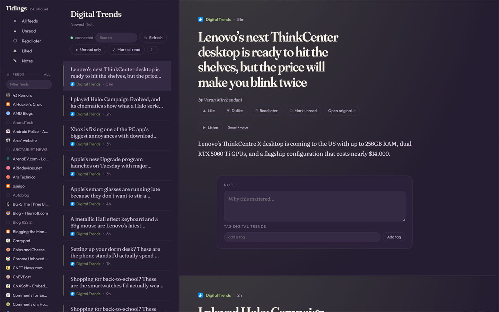
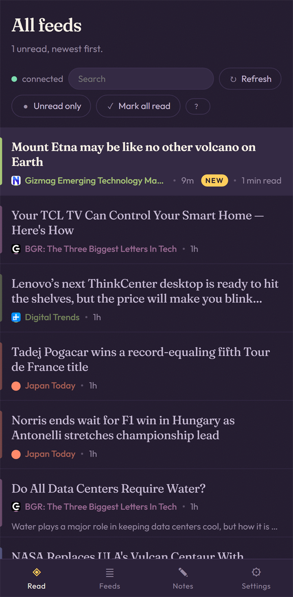

<p align="center">
  
</p>

<h1 align="center">ArticleFlux</h1>

<p align="center">
  <strong>A self-hosted feed reader that is Go all the way down.</strong><br>
  The server is Go. The client is Go compiled to WebAssembly. The CSS is Go.<br>
  The transport is real gRPC — in the browser. The only JavaScript that ships is a boot shim.
</p>

<p align="center">
  
  
  
  
  
  
  
</p>

---

## The pitch

Google Reader died in 2013 and nothing replaced it. What replaced it was a choice between somebody
else's server holding your reading history, or a self-hosted PHP app from 2011 with a mobile site
that does not work.

ArticleFlux is the third option. **One binary, one SQLite file, no runtime dependencies, and a client
that is a real application rather than a page** — virtualised lists at firehose scale, a keyboard
map your fingers already know, full-text search, tags, notes, offline-capable delivery, and text to
speech.

The interesting part is not the feature list. It is that **a browser application of this size was
written entirely in Go**, with no JavaScript framework, no bundler, no `npm install`, no TypeScript
build, and no REST layer translating between the two halves — and that the two libraries which make
that possible, [GoWebComponents](#gowebcomponents--the-ui-is-go) and
[GoGRPCBridge](#gogrpcbridge--the-wire-is-real-grpc), are reusable in any project that wants the
same deal.

<table>
<tr>
<td width="62%" valign="top">

### What you get

- **Three panes, Google Reader's key map.** `j` `k` `o` `s` `r` `u` do what your hands expect.
  Muscle memory transfers on day one — the vocabulary was kept on purpose.
- **Real scale.** The instance in the screenshot above holds **151 subscriptions and 3,621 items**.
  The list is virtualised and sized to the scope's *true* total rather than to what has been
  fetched, so the scrollbar is honest from the first paint. The article pane is a continuous stream:
  reaching the bottom appends the next piece, scrolling up prepends the previous one with the
  position held, and nothing is ever taken away from under the reader.
- **Full-text search** over SQLite FTS5, not a `LIKE` query pretending.
- **Tags, notes, read-later, likes** — and a rating signal that feeds the ranking layer.
- **Every source owns a hue.** It runs through the sidebar dot, the row edge, the dateline and the
  wash behind the article. On a phone, a 3px coloured edge answers *who wrote this* faster than
  reading a byline. Ornament that carries information, or it does not ship.
- **Listen to any article** — synthesised speech, cached, from the reader.
- **Multi-tenant by design.** Sources and items are global and deduplicated; a popular feed is
  polled once no matter how many people subscribe.
- **It fetches safely.** Every outbound fetch goes through an SSRF guard: link-local and the cloud
  metadata endpoint are never reachable, on any configuration.

</td>
<td width="38%" valign="top">

<p align="center"><em>The same binary, on a phone. Not a separate app,<br>not a scaled-down mode — one responsive client.</em></p>
</td>
</tr>
</table>

---

## Sixty seconds to a running reader

```powershell
./scripts/make.ps1 build
./bin/articleflux.exe seed    # subscribe to a starter set and fetch it
./scripts/make.ps1 dev    # http://127.0.0.1:9000
```

```powershell
./scripts/make.ps1 dev      # build the client and serve it
./scripts/make.ps1 e2e      # Playwright, desktop + phone, against a real server
./scripts/make.ps1 test     # go test ./...
./scripts/make.ps1 lint     # go vet, buf lint, and the five structural guards
```

`dev` serves the local account with **no login** — the client asks the server at boot and goes
straight to the reader, no password prompt. It is refused on any bind but loopback, and refused
alongside `-behind-proxy`. `cp .env.example .env` documents the same switch as `ARTICLEFLUX_DEV=1`,
along with the dev credentials (`cam` / `articleflux-dev`) for when you want to exercise the login
screen itself — and on a loopback origin the login screen prefills both fields with them, so it is
one click.

On Linux the same verbs exist as a `Makefile` — `make dev`, `make test`, `make lint`. The two are
kept identical on purpose; two build systems is only a lie if they disagree.

No Node for the app. No Docker. No WSL. Node appears exactly once, in the e2e suite, because
Playwright drives a real browser.

---

## Putting it on a server

**[`deploy/README.md`](deploy/README.md)** takes a bare Ubuntu droplet to a reader on TLS in about
twenty minutes: systemd unit, nginx site with the WebSocket settings the tunnel needs, certbot,
and a nightly verified backup. Ships with it:

| | |
|---|---|
| [`deploy/articleflux.service`](deploy/articleflux.service) | Hardened systemd unit — loopback bind, unprivileged user, `ProtectSystem=strict` |
| [`deploy/nginx.conf`](deploy/nginx.conf) | The `/grpc` block, whose four settings are the difference between a working tunnel and one that drops every sixty seconds |
| [`deploy/articleflux-backup.{service,timer}`](deploy/) | `VACUUM INTO` + `PRAGMA integrity_check` nightly, because a `cp` of a WAL-mode database restores cleanly and is silently missing a transaction |

A hosted instance requires a login. Create the first account once:

```bash
articleflux init -db /var/lib/articleflux/articleflux.db -user cam
```

The server refuses to start rather than serving a login screen nobody can get past — along with
two other boot checks (missing web root, unwritable data directory) that otherwise surface hours
later while `/healthz` reports green.

---

## Built on two libraries worth stealing

ArticleFlux is the proof that these two work together on something real, and it is small enough to read.
If you only take one thing from this repository, take one of these.

### GoWebComponents — the UI is Go

**[github.com/monstercameron/GoWebComponents](https://github.com/monstercameron/GoWebComponents)**

A Go + WebAssembly UI framework with a React-shaped component model: hooks, a fiber runtime, typed
HTML builders, client-side routing, shared state, streaming SSR with hydration, crash containment,
i18n, PWA support — all in one Go module.

The part that changes how a project feels is **the CSS engine**. Styles are Go values, compile-checked,
colocated with the component:

```go
css.Rule(".row",
    css.Custom("--c", css.Var("hue")),
    css.BorderLeft("3px solid", css.Var("c")),
    css.Media("(max-width: 720px)", css.Padding("0.5rem")),
)
```

There is **not one `.css` file in this repository**, and CI fails if one appears. There is not one
application `.js` file either. The stylesheet, the layout, the interaction and the state are the same
language as the query planner — which means a rename is a compiler error rather than a bug report,
and a designer's change lands in `client/design/sheet.go` next to the component it styles.

> **What it costs, honestly:** the wasm bundle is 23.8 MB, 5.2 MB gzipped, and CI fails the build if
> it grows more than 5% without someone bumping the baseline on purpose. That is the trade: a large
> first load, cached thereafter, in exchange for deleting an entire toolchain. ArticleFlux decided the
> trade was worth it and made the Service Worker load-bearing. Decide it yourself before adopting —
> the framework's README says the same thing.

### GoGRPCBridge — the wire is real gRPC

**[github.com/monstercameron/GoGRPCBridge](https://github.com/monstercameron/GoGRPCBridge)**

Browsers cannot open raw TCP sockets, so a standard gRPC client does not work in a `js/wasm` build.
The usual answer is to give up and write a REST layer — hand-rolled JSON on both sides, drifting
silently, with the contract living in a wiki page.

GoGRPCBridge tunnels HTTP/2 gRPC frames over a WebSocket instead:

```text
Browser (Go WASM gRPC client)
  └─ WebSocket
       └─ grpctunnel bridge handler (net/http)
            └─ HTTP/2 ⇄ in-process grpc.Server
                 └─ your existing protobuf services
```

Your `.proto` files do not change. Your generated clients do not change. Server integration is
`grpctunnel.Wrap(grpcServer)`, which is an `http.Handler`. All four RPC types work — unary,
server-streaming, client-streaming, bidirectional — plus deadlines, metadata and interceptors. It
ships origin allowlists, pre-upgrade authorization, connection caps, keepalive with transparent
reconnection, OpenTelemetry spans, and a native-transport mode that is 47% lighter on memory per RPC.

In ArticleFlux this is what the `connected` dot in the toolbar reports, and it is why the client and the
server cannot disagree about a field name: **`proto/articleflux/v1` is the only contract, and both ends
are generated from it.** Twenty-four RPCs across two services, all unary today; the tunnel is ready
for streaming when the ranking layer needs it.

---

## How it is put together

```
cmd/articleflux        the binary: serve · seed · poll · version
internal/store     ALL SQL lives here. Two pools: many readers, one writer
internal/feed      fetch + normalise. Every fetch goes through the SSRF guard
internal/reader    the service layer — one place that knows what "mark read" means
internal/transport gRPC, thin: message translation and the error taxonomy
client/            the wasm app. design/ (tokens + stylesheet), view/, data/, platform/
proto/             the contract all transports share
```

Four decisions shape most of the code:

- **Sources and items are global and deduplicated.** One popular feed is polled once no matter how
  many people subscribe. That is why read/star state lives in its own table, and why global rows are
  never hard-deleted — a cascade from `items` would destroy every other tenant's history.
- **Two connection pools.** SQLite allows many readers and exactly one writer; modelling that as two
  pools makes the constraint structural instead of a race.
- **All CSS is Go.** There is no `.css` file in this repository and CI fails if one appears.
- **`syscall/js` lives in exactly one package**, so every other client package compiles — and is
  testable — natively.

**Each of the four is enforced by a guard in `internal/tools/guards`, not by convention.** A decision
that is only written down is a decision that erodes; a decision with a build failure attached is a
decision.

## Tested

| | |
|---|---|
| Go tests | 16 packages, run on Windows in CI |
| e2e | Playwright, desktop **and** phone, against a real server and a real database |
| Design parity | the palette, three type stacks, and one hue reaching all four surfaces, checked mechanically |
| Structural guards | four, all green, run on every push |
| Contract | `buf lint` plus `buf breaking` — additive-only within v1, because old clients exist in the wild |
| Bundle size | ratcheted against a checked-in baseline; +5% fails the build |

## The documents

`plan.md` is the spec of record, `TODO.md` the dependency-ordered build, `FLOWS.md` the nine paths
that are easy to get subtly wrong, and `design/` the visual specification (hand-written HTML that
nobody ports — the reader is rebuilt from it in Go).

They are kept in sync with the code deliberately, and the precedence rule is written down: **if the
implementation contradicts `plan.md`, the plan is wrong, and it gets corrected in the same change.**
A spec that has quietly drifted is worse than no spec, because it still gets trusted.

Start at `TODO.md` Tier 9, where every milestone has a complete brief: the plan sections that define
it, the pages, the components, the flow diagram, and the tests that must go green.

## Notes for anyone picking this up

- **GoWebComponents v5 was never tagged**, so `go.mod` carries a `replace` to a sibling checkout. CI
  materialises it the same way. Remove both once the tag is pushed.
- **FTS5 is not compiled into `ncruces/go-sqlite3`.** It is a loadable extension that must be
  registered on every connection — see `internal/store.Open`. There is a permanent test for this, so
  a dependency bump that drops FTS5 fails the build instead of silently removing search.
- **`Props.Style` cannot set CSS custom properties** in GWC — it assigns JS properties, and that path
  does not reach `--vars`. Use a style *string* through `Raw`. This silently rendered every hue grey
  and no test that did not open a browser could see it.
- **A `func(string)` event handler receives `event.target.value`**, not the key — so search-on-Enter
  silently never fired.
- **The dev server runs without a login**, and only ever on a loopback bind. Binding a real interface
  turns that off, because an internet-facing instance with it on would be an open reader.

## Contributing

Read [CONTRIBUTING.md](CONTRIBUTING.md) first — the doc discipline and the "when the spec is silent"
rule are the whole culture of this repository, and they are short.

## Licence

MIT. See [LICENSE](LICENSE).
