<p align="center">
  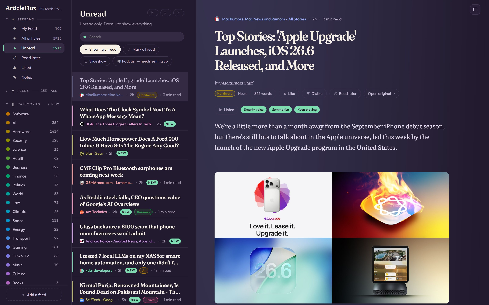
</p>

<h1 align="center">ArticleFlux</h1>

<p align="center">
  <strong>A self-hosted feed reader that is Go all the way down.</strong><br>
  The server is Go. The client is Go compiled to WebAssembly. The CSS is Go.<br>
  The transport is real gRPC — in the browser. The only JavaScript that ships is a boot shim.
</p>

<p align="center">
  <a href="https://monstercameron.github.io/ArticleFlux/"></a>
  <a href="https://github.com/monstercameron/ArticleFlux/actions/workflows/ci.yml"></a>
  <a href="https://github.com/monstercameron/ArticleFlux/actions/workflows/pages.yml"></a>
</p>

<p align="center">
  
  
  
  
  
  
  
</p>

---

## Try it without installing anything

There is a **[live demo](https://monstercameron.github.io/ArticleFlux/)** — the real reader, with an
invented instance compiled into the same WebAssembly module. No account, no server, nothing stored:
the "server" is the browser tab, and closing it is the undo button. Reading, marking, starring,
notes, tags, categories, search, subscribing and mark-all-read-with-undo all work.

It is the shipping client, not a mock-up of it — same components, same client, same generated gRPC
stubs, with only the transport swapped underneath. [`docs/DEMO.md`](docs/DEMO.md) explains how, and
what it deliberately cannot do (anything needing a server: Smart+, translation, the page proxy).

---

## The pitch

Google Reader died in 2013 and nothing replaced it. What replaced it was a choice between somebody
else's server holding your reading history, or a self-hosted PHP app from 2011 with a mobile site
that does not work.

ArticleFlux is the third option. **One binary, one SQLite file, no runtime dependencies, and a client
that is a real application rather than a page** — virtualised lists at firehose scale, a keyboard
map your fingers already know, full-text search, tags, notes, offline-capable delivery, and text to
speech.

The interesting part is not the feature list. It is that **a browser application of this size was
written entirely in Go**, with no JavaScript framework, no bundler, no `npm install`, no TypeScript
build, and no REST layer translating between the two halves — and that the two libraries which make
that possible, [GoWebComponents](#gowebcomponents--the-ui-is-go) and
[GoGRPCBridge](#gogrpcbridge--the-wire-is-real-grpc), are reusable in any project that wants the
same deal.

Every screenshot on this page is the real application against the development instance in the
picture above: **153 feeds, 7,303 articles, 5,913 of them unread**, in a 126 MiB SQLite file. The
counters differ slightly from shot to shot because the poller runs every fifteen minutes and did
not stop for the photographs. Nothing here is a mock-up, and the shots are regenerated by
[`e2e/home-shots.mjs`](e2e/home-shots.mjs) against a running server whenever the chrome changes, so
a stale picture is a build step rather than an oversight.

**And every shot is in a different theme**, rotating through all five. That is not decoration: the
palette is a table of Go values resolved at render time, so a screenshot in *Daylight* is the same
code path as one in *Ink* — same components, same stylesheet, one token table swapped. A page of
screenshots that were all one colour would be hiding the single thing the design system is for, and
would let a theme rot unnoticed: nothing catches *"Ledger broke six days ago"* if nobody ever
photographs it.

### What you get

- **Three panes, Google Reader's key map.** `j` `k` `o` `s` `r` `u` do what your hands expect.
  Muscle memory transfers on day one — the vocabulary was kept on purpose.
- **Real scale.** The list is virtualised and sized to the scope's *true* total rather than to what
  has been fetched, so the scrollbar is honest from the first paint. The article pane is a
  continuous stream: reaching the bottom appends the next piece, scrolling up prepends the previous
  one with the position held, and nothing is ever taken away from under the reader.
- **Full-text search** over SQLite FTS5, not a `LIKE` query pretending — live now, on a pause in
  typing rather than only on Enter.
- **Tags, notes, read-later, likes** — and a rating signal that feeds the ranking layer.
- **Every source owns a hue.** It runs through the sidebar dot, the row edge, the dateline and the
  wash behind the article. On a phone, a 3px coloured edge answers *who wrote this* faster than
  reading a byline. Ornament that carries information, or it does not ship.
- **Listen to any article** — your browser's own voice for free and offline, or a better one from
  the server; either way it is cached, and the slideshow can read a whole feed to you.
- **Multi-tenant by design.** Sources and items are global and deduplicated; a popular feed is
  polled once no matter how many people subscribe.
- **It fetches safely.** Every outbound fetch goes through an SSRF guard: link-local and the cloud
  metadata endpoint are never reachable, on any configuration.

---

## FluxCast — your feed, produced as a programme

<p align="center">
  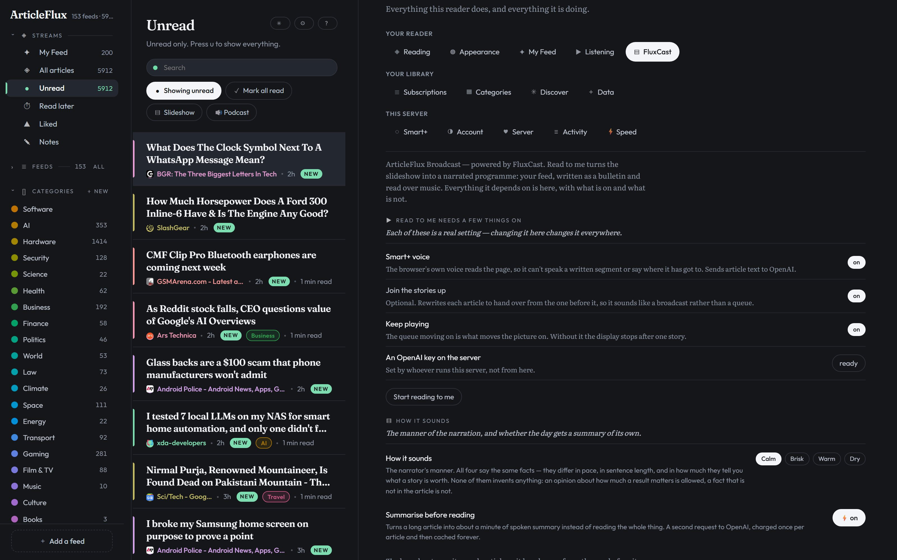
</p>

<p align="center"><em>Settings → FluxCast, in <strong>Ink</strong>. The one screen in the application
where the name appears — every control elsewhere keeps a plain verb — and the only place the
broadcast's four prerequisites are stated <strong>with their current state</strong> rather than
discovered by entering the mode and getting silence.</em></p>

Press **Podcast** instead of Slideshow and the reader stops being a reader. Your feed is written as a
bulletin, opened by a greeting and a run-through of the headlines, read over music, story handing
over to story until you stop it. **FluxCast is the layer that decides what that programme is** — what
gets selected, how it is grouped and ordered, how long each story gets, and what is said between
them — and then hands a finished rundown to the narrator.

It is the piece of this project that is least like a feed reader and most worth reading the code of.
`plan.md` §19 owns what it sounds like, §29 owns the producer underneath, and `TODO.md` Tier 11 is
the live build list.

### The three rules the whole thing is built under

**1 · The rundown is Smart; the broadcast is Smart+.** Selection, clustering, grouping, ordering and
airtime are deterministic arithmetic over data the ranked homepage already computed. They cost
nothing and need no API key. **An instance with no key still produces a real, complete, playable
rundown** — real segments, real ordering, real airtime, narrated by the same per-item voice. What a
key buys is that it *sounds like a programme*: a segment that reads as one thing rather than a list,
an opening that greets you with the shape of the day, transitions that are prose rather than
silence. This is the free-tier answer, and the feature is designed around it rather than degrading
to it.

**2 · The planner may shape, and may never rank.** There are already two opinions about relevance
here — `rank.Score`, and `Interest.RerankCandidates` for Smart+ readers — and both explain
themselves through `reasons_json`. A third opinion with no reasons attached is not an improvement,
so the planner **consumes** the ranking. It decides segments, order, airtime and transitions. It
never decides what is worth hearing.

**3 · One item is one audio file is one slide.** `/speech` is reached with a per-item, AES-GCM sealed
ticket; the progress hairline comes from that file's playhead, and read-state fires on `ended`. A
segment spanning three stories would break the ticket, the slide boundary, the cue points and the
bookkeeping at once — so **the rundown writes per segment and synthesises per story**: one model call
produces a whole segment, transition included, as per-story prose blocks, and each block is
synthesised under its own ticket exactly as a single article already is. The three-second musical
seam covers the joins.

### What you actually hear

<p align="center">
  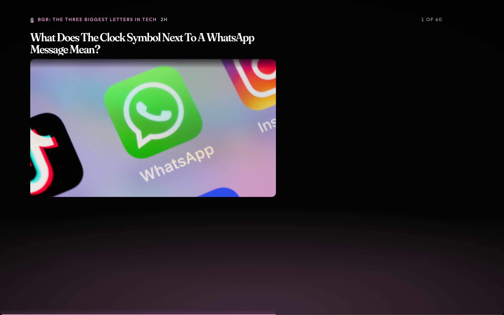
</p>

<p align="center"><em>The display half, mid-story, in <strong>Contrast</strong>. One hairline across
the foot of the screen is the progress meter, the on-air light and the audio playhead — one element,
three jobs — and the whole screen carries the source's hue, because from four metres away a colour
changing is legible and a progress bar is not.</em></p>

The opening theme starts loud, drops under the narrator while they greet you and run the headlines,
**swells for five seconds when they finish**, and fades out as a quieter bed rises underneath the
first story and stays there for the rest of the show. Two openings ship and one is picked at random
per session, so a regular listener does not hear the same one every evening; two beds ship and you
choose yours. Between stories the bed **lifts for about three seconds** and the next story begins
into the lift, so a running order sounds like a programme rather than a queue.

- **The handover is triggered by the voice, not by a clock.** The next segment is loaded, reports
  `ready` on `canplay`, and is **held**; the theme fades out and the bed fades in; the voice is
  released two seconds into that fade. A timer-driven version is out of phase by construction — the
  one duration it cannot know is the only one that matters — and reacting to playback *starting* is
  too late by definition. Verified against the live server by hooking `AudioParam` and
  `HTMLMediaElement.play`: greeting ends at 44.7s, theme swells, crossfade at 56.6s when the segment
  reported ready, voice at 58.6s.
- **Two music channels, not one**, and that is a mixing decision rather than an implementation
  detail. The opening is a piece with a front to it; the bed is furniture. On one channel the
  handover between them is a crossfade you cannot perform, because you would be fading a track out
  and the same element in.
- **The levels are in the source, with their reasoning.** Theme 0.16 open and 0.038 under a voice;
  bed 0.021 resting, 0.0105 ducked, 0.036 in a seam; the chime expressed as a *fraction of the
  theme* rather than as its own numbers, because independent numbers in a different file survived
  two rounds of turning the music down and made both look unapplied. Halving a gain is −6 dB, not
  half as loud.
- **The seam is measured from the end of the last story**, so a segment that took ten seconds to
  synthesise adds nothing on top — the wait it already imposed *was* the seam.
- **Pausing pauses the music where it is** rather than fading it out, so pressing play picks the
  programme up instead of starting the track over. The screen is kept awake while it runs and
  released the moment it stops.
- **The narrator's manner is yours** — Calm, Brisk, Warm, Dry. All four say the same facts; they
  differ in pace, in sentence length, and in how much they tell you what a story is worth. None of
  them invents anything: *an opinion about how much a result matters is allowed, a fact that is not
  in the article is not.*

### The engine: pure, four passes, and one honest lever

`internal/fluxcast` has **no clock, no network, and no randomness that is not seeded**. The same
input gives the same programme byte for byte — which is what makes a cue sheet diffable, a variation
replayable, and the wasm client able to carry the player and the timeline compiler without carrying
the database. Planning runs in four passes, separate because each fails in a way the others cannot
explain:

| | | a failure here means |
|---|---|---|
| **FILL** | which stories go in which block, under its filter and appetite | a feed problem |
| **FIT** | word budgets adjusted so each block, then the show, lands on target | a format problem |
| **ANCHOR** | blocks that must start at an offset get padded to it | the show ran late; it says so |
| **KEY** | beat ids and script cache keys, computed last | — |

**There is exactly one honest lever.** Spoken length is words divided by speaking rate; the rate
belongs to the listener and the audio belongs to a synthesiser, so the only thing an editor can
change is **how many words each beat gets**. Every target resolves to a word budget and never to a
cut, a fade or a speed-up — truncating audio to fit a clock is what bad automation does and it is
audible in the first second.

**Bounds are not advisory.** A lead cannot be written in forty words and a namecheck cannot carry two
hundred, so every beat has a floor and a ceiling derived from its role (`LEAD`, `SUPPORTING`,
`STANDARD`, `QUICK_HIT`, `MENTION`) — and the fitter will **miss a target rather than cross one, then
say so**. A format that cannot be met is a format problem, and a fitter that silently produced a
40-word lead would hide it behind a number that looked right.

**The estimate is a model of a model.** Words per minute is an average of a synthesiser reading prose
that has not been written yet — close, never exact — so every estimate in the cue sheet is marked
with a tilde, and `Trace.Calibrate` closes the loop: play a show, measure what the audio actually
ran to, and the next plan is fitted against reality. **Nothing in the planner fails silently and
nothing refuses.** A programme that missed its target by forty seconds is still a programme, and the
notes say why.

### A programme's shape is a file

A **format** is the shape of a show independent of what is in it: greeting, headlines, three minutes
of world news, a tease, six minutes of technology, a recap at exactly ten minutes, sign-off. It is
deliberately orthogonal to the **profile** (how it sounds — ramps, gains, holds) and to the
**rundown** (what is worth hearing), so the same half-hour magazine shape can be brisk or ambient
without being rewritten.

```json
{
  "name": "five-minute-roundup",
  "target": "5m",
  "tolerance": 0.03,
  "profile": {
    "preset": "bulletin",
    "why": "at five minutes the choreography is 6% of the programme; three-second seams across seven stories are 21 seconds, which is a whole story",
    "overrides": { "choreo.seamHold": "1.2s", "choreo.introHold": "1.5s" }
  },
  "source": { "from": "my-feed", "window": "24h", "exclude": { "read": true, "heard": "7d" } },
  "voice":  { "manner": "brisk", "address": "second-person", "lexicon": { "psql": "sequel" } },
  "rules":  { "never": ["never say 'more on that later' — at this length there is no later"] },
  "on": {
    "program:end": { "voice": { "energy": -1 }, "direction": "land it in one sentence and stop" },
    "block:begin": { "rules": { "never": ["never say 'welcome back' — nobody went anywhere"] } }
  }
}
```

- **Blocks flow; anchors do not.** Most blocks follow the one before. A block with `at` set *must*
  start at that offset, which is what makes "the recap is at the half hour" expressible. The
  compiler pads with music when the show runs early and reports a note when it runs late, because it
  cannot go back in time and pretending otherwise is how a running order silently stops meaning
  anything.
- **One merge rule, everywhere.** Direction resolves down a cascade — profile → format → program →
  block → block kind → block id → exceptions — and **scalars override, lists append, `energy` sums
  and clamps.** One rule so a reader of a format never has to ask which mechanism is in play.
- **JSON has no comments, so every object may carry `why`.** Ignored by the engine, printed in the
  cue sheet. Every number in the profile carries its reasoning in a Go doc comment; a format file
  with nowhere to put *"0.25 because at five minutes one boosted story is a fifth of the show"*
  would lose that the moment it left this repository.
- **No SQL, ever, and not as a matter of taste.** A query in a config file is a schema coupling and
  an injection surface **in a document a model may one day write**. A format names a *pool*; the
  store owns the query, exactly as it names a track id and the catalogue owns the bytes.
- **Direction is egress, and it is declared.** The audience, house style, standing instructions and
  refusals in a format are prose the instance's owner wrote, and they cross to the provider with
  every beat alongside the article text. So they live in one struct that can print itself: **a
  feature that sends your articles somewhere and cannot produce the list is a feature that has not
  finished.**

### The player was extracted so it could be tested

Every audio call used to be a direct `syscall/js` call from inside a 7,000-line component, which
meant the only way to find out what the broadcast did was to listen to it. The player now emits
**actions** into a driver — a browser in production, a struct in tests — and cannot tell the
difference. It holds a loaded beat at exactly two gates (the crossfade out of the theme, and the lift
between two stories), because in both the music has to *move first*: a fade that begins when the
voice does is a fade you hear happening under the voice. Its phase is reported and never branched
on, because a state machine that branches on the same string it prints is one that eventually prints
a lie.

```
internal/fluxcast   plan · fit · format · direction · profile · timeline · mix · player · driver
internal/rundown    what plays, pure structure — Story is {ItemID, ClusterID, Role, Words, Sources}
internal/smart      the prose: the segment writer, the opening, the transitions
```

### What is not built yet, stated plainly

- **The on-screen rundown** — the screen that shows what *will* play. It has to be the same code as
  the producer or the screen lies about the show.
- **The editorial planner's model call**, gated on a naming decision (`plan.md` §29.3, gate G6): the
  deterministic selection it falls back to is a complete product by its own definition, which is why
  `rundowns.state` has two values and no `failed`.
- **The segment-ahead producer** on the durable queue, and the circuit breaker in front of the
  planner.
- **A known bug, wearing a feature's clothes.** In narrated mode the slide still renders the
  *article* while the voice speaks the rewritten *segment*, and scrolls it from the segment's
  playhead. The two texts diverge within a paragraph, and nothing caught it because both are
  plausible prose on a screen. The fix (`TODO.md` 11.46) puts the **script** on the surface that is
  already correct, with the spoken sentence emphasised — captions timed by splitting the script on
  sentence boundaries and giving each a share of the audio's real duration, because the provider
  returns no word timings and paying a second model to align them would be a bill for a caption.

---

## What landed in the last week

This README was last rewritten on **27 July, 191 commits ago**. The project itself is 353 commits
old — it started on 26 July 2026. This is what has shipped since, and every item below is in the
running application unless the entry says otherwise.

### Reading

<p align="center">
  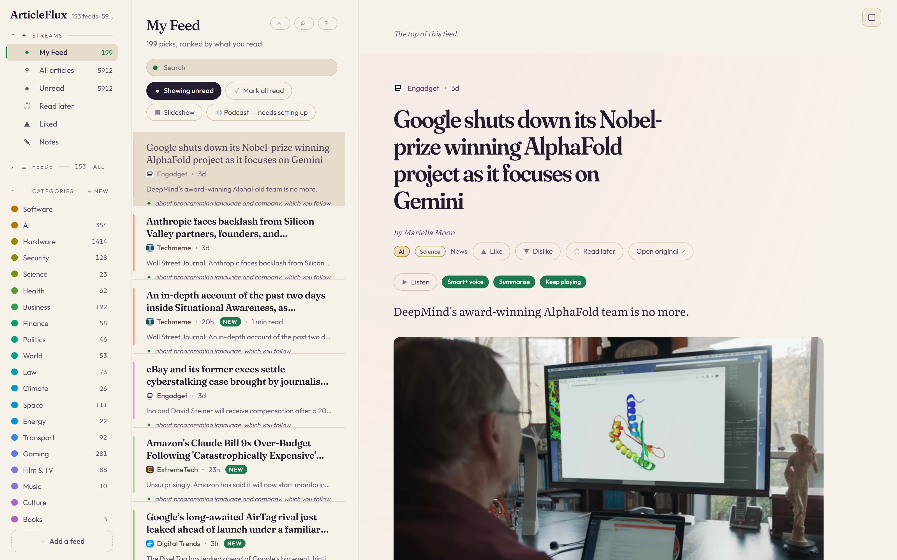
</p>

<p align="center"><em>My Feed, in <strong>Daylight</strong>.</em></p>

- **My Feed — a ranked stream that says why.** 199 picks out of 5,913 unread, ordered by what you
  actually read, and **every row carries its own reason in plain words**: *about OpenAI, which you
  follow*, *about NVIDIA and AMD, which you follow*, *MOVED UP: reports skilled-trade hiring*. A
  recommendation you cannot interrogate is a recommendation you cannot correct, so the reasons are
  stored as ordered clauses with machine keys beside them rather than as a score. The 70/20/10 split
  between top picks, exploration and cluster heads is inherited by everything downstream that
  selects stories — including the broadcast.
- **Categories, and a classifier behind them.** The rail carries a category list with live counts —
  *Hardware 1,414 · AI 354 · Gaming 281 · Business 192 · Space 111* — placed by a deterministic
  on-machine pass: no key, no egress, no bill. Every row carries its chip, the Categories tab lets
  you hide the ones you do not want, and a category you remove is never re-applied behind your back.
- **Live updates without a refresh.** The event ring buffer, the streaming RPC and the client pump
  are wired end to end: something happens on the server and the screen changes. Asserted from the
  outside in its own e2e spec — poll the server, watch the unread count move — rather than by
  reaching into client state.
- **Discover** (Settings → Discover). Sites you do not follow yet, found from what you already read,
  and **every suggestion says why**. Harvested from outlinks and aggregator pass-through, gated on
  whether the source is actually healthy, with permanent dismissal — a suggestion you turned down
  does not come back next week wearing a different hat. The harvesting engine sat with no screen in
  front of it until this landed.

<p align="center">
  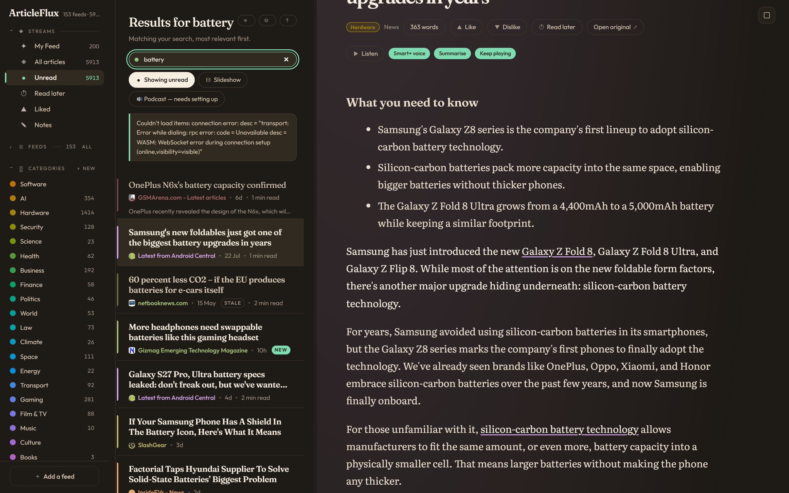
</p>

<p align="center"><em>Search, in <strong>Ledger</strong>.</em></p>

- **Search runs as you type.** A 300ms pause fires it; Enter still flushes instantly and wins any
  race with a pending timer; clearing back to empty debounces on the same timer so the unfiltered
  list does not flash up mid-retype. One known flake is documented rather than hidden — see
  `TODO.md` → *Search goes live, with a known flake it shipped despite*.
- **Feed health is visible in the results.** `STALE` badges on rows from sources that have stopped
  publishing, and the Server tab counts them without rounding the number up: *153 · 29 not
  responding*.

### Listening

<p align="center">
  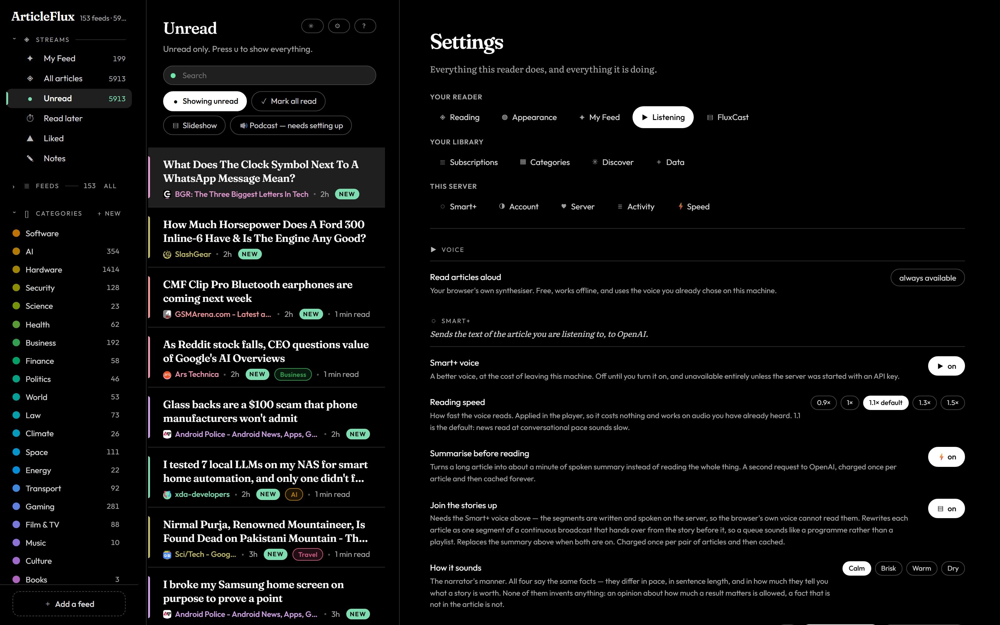
</p>

<p align="center"><em>Listening, in <strong>Contrast</strong> — black ground, white type, hard edges.</em></p>

- **Read to me, at your pace.** Reading speed is 0.9× to 1.5×, default **1.1×**, applied in the
  player rather than bought from the voice — so it costs nothing and takes effect instantly, even on
  recordings you have already heard.
- **Summarise before reading.** A long article becomes about a minute of spoken summary, charged
  once and cached forever.
- **Two entry points instead of one and a preference.** *Slideshow* is the display: clock-paced, no
  prerequisites, no key, no spend, works on any instance. *Podcast* is the programme. A reader who
  presses one and gets the other has been surprised by a toggle they set last week, which is exactly
  what a persisted `slides.audio` made possible and what two buttons make unrepresentable — and the
  Podcast chip **states what it is missing before it is pressed** rather than after, which is why it
  reads *Podcast — needs setting up* in the screenshots above.
- **Everything the broadcast is** has its own section: [FluxCast](#fluxcast--your-feed-produced-as-a-programme).

### How it looks

<p align="center">
  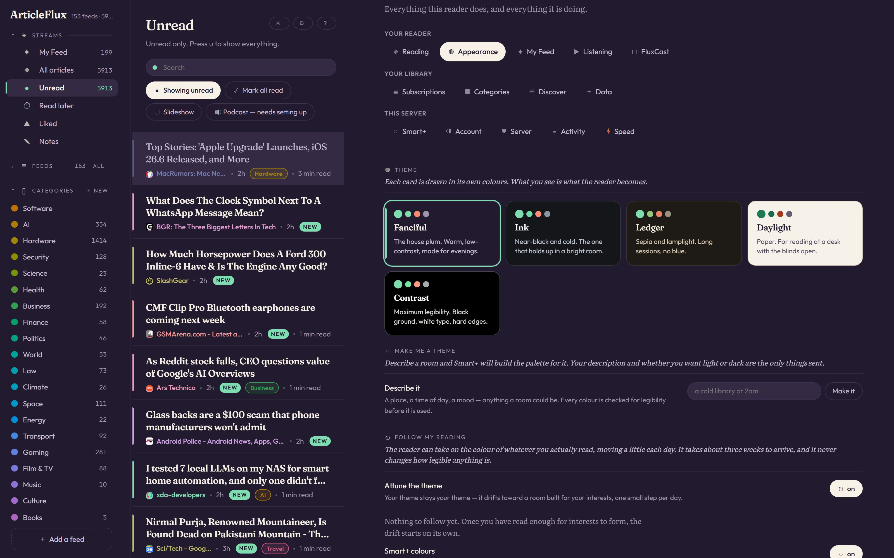
</p>

<p align="center"><em>Appearance, in <strong>Fanciful</strong> — the screen that changed every other screenshot on this page.</em></p>

- **Five themes, each card drawn in its own colours.** What you see on the card is what the reader
  becomes.
- **A theme you describe.** *"a cold library at 2am"* → Smart+ writes the palette, and **every
  colour is checked against a legibility floor before it is used**. Your description and whether you
  want light or dark are the only things that leave the machine.
- **A theme that follows what you read.** Opt in and the reader drifts toward a room built out of
  your own interests, one small step per day — about three weeks to arrive, and it never changes how
  legible anything is. The screen tells you how far along it is and what it is drifting toward.

<p align="center">
  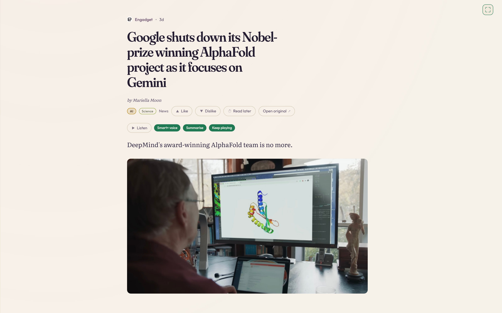
</p>

<p align="center"><em>Focus mode, in <strong>Daylight</strong> — one article ending and the next beginning, in one continuous column.</em></p>

- **Focus mode (`w`)** gives the article the window; **the slideshow (`s`)** gives it the screen and
  then keeps going by itself — title card, source colour washed up from the bottom edge, one
  hairline at the foot that is the progress meter, the on-air light and the audio playhead at once.
  It is meant to be left running across a room, so nothing blinks, nothing waits for a pointer, and
  it loops rather than going dark in the middle of the afternoon.

### Adding, organising, and getting your data out

<p align="center">
  
</p>

<p align="center"><em>Add a feed, in <strong>Ink</strong>.</em></p>

- **Named and filed at the moment of adding**, with **Smart+ suggesting the category** so a new feed
  does not land in *Unfiled* by default.
- **Smart+ follow** — when the address is not a feed, the model writes a scrape rule for the page
  instead of refusing.
- **A Data tab, at last.** OPML in and out from the interface, and the report separates *new to you*
  from *you already had this* and **names the rows that did not make it, with the reason** — because
  "12 skipped" is not something a person can act on. Until this existed the only importer was
  `articleflux import`, which needs a shell on the server: a documentation gap on a single-user box
  and no path at all for a member on a multi-tenant one. Netscape bookmarks and Chrome JSON are
  parsed too, from the command line.
- **The settings surface is grouped, not flat** — fourteen tabs in three bands (*your reader*, *your
  library*, *this server*) so position carries meaning instead of history.

<p align="center">
  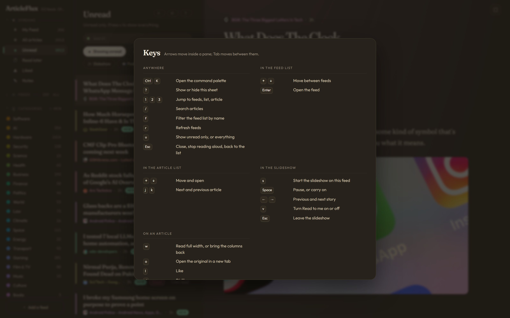
</p>

<p align="center"><em>The shortcut sheet, in <strong>Ledger</strong> — <code>?</code> from anywhere.</em></p>

### Running it

- **A front door at `/home`**, and it is a component like everything else. It was a static
  `home.html` first; two things were wrong with that, and only one of them was the rule. The rule is
  that the stylesheet is Go and no marketing page is exempt. The other is that **the server's own CSP
  blocked it on first load** — the hash pins the shell's boot script, so the page's inline script
  never ran. A front door that has to be excused from the product's constraints is advertising
  something the product is not. Now it paints from the same design tokens, so a visitor who has set
  *Daylight* gets a Daylight homepage, and `j` `k` `o` `?` work on it. It is deliberately **not**
  mounted at `/`: an account arriving at the origin wants their articles, not a pitch for the
  software they already run.
- **Setup from the browser.** An unclaimed instance shows a setup screen instead of a login screen —
  first account, and recovery codes it will not let you skip. It is a boot state, not a route, so
  there is no window in which the claim page is reachable on an instance that already has an owner.
- **Deploy scripts with a watchdog.** `install.sh`, `update.sh`, `rollback.sh`, `diagnose.sh` and a
  health timer, plus a deploy hook that fires **when CI goes green**, not when someone pushes. A
  failed deploy now exits non-zero and says so — it used to exit 0 and get recorded as a success.
- **`dev` is where work lands, `main` is releases, and promoting is the deploy.** The promotion gate
  tests the branch that is arriving, not the one it is replacing.

### Security, and being honest about it

- **A cross-account session-minting bug, closed.** A client-supplied device id could collide with
  another account's row, and the conflict resolver replaced the refresh secret while keeping the
  original owner — so a second login could install its own token against somebody else's account.
  The field is now split into a presentation-only label and a server-generated record id, and the
  write refuses on any ownership mismatch.
- **Refresh families revoke properly.** Signing out kills the family, not just the session; changing
  a password revokes every *other* family in the same transaction as the hash update.
- **Refresh-token issuance is off by default** until client-side rotation exists. That is the honest
  stopgap, and it is written down as one rather than presented as finished.
- **Passwords are no longer accepted as command arguments** — `ps` output and shell history both
  outlive the command that typed them.
- **The sanitizer has a fuzz target now**, and the crashes the runs found are checked in as seeds.
  It was the one parser here that fails by executing somebody else's code, and it was the one
  without a fuzzer.

### Under the floor

- **Go statement coverage above 90% across ~40 packages** — a package-by-package sweep of real
  table-driven tests, which found and fixed two live bugs on the way through.
- **`internal/cast` became `internal/fluxcast`**, because the engine should be the package that
  carries the name.
- **`/speech?as=text`** returns the script for a beat whose audio already exists — free, because the
  script is already in the cache, and it answers 204 rather than quietly buying a second copy of the
  programme.
- **And one bug found by taking these screenshots.** Rotating the theme between captures turned up a
  real one: **a theme changed after a client-side navigation updates `:root` but leaves `<body>`'s
  background on the previous theme**, so Contrast's white type gets drawn on Daylight's paper ground
  and every secondary label goes invisible. Switching twice inside one settings session does not
  reproduce it, which is why the appearance e2e specs never caught it — they assert on the same page
  they set the theme from. Filed in `TODO.md` with the DOM measurements; the shot script reloads
  after every switch and says why.

---

## The same binary, on a phone

Not a separate app, not a scaled-down mode — one responsive client, and every screenshot above was
captured a second time at 390px because a phone shot of a three-pane application is a *different
photograph*, not a smaller one.

<table>
<tr>
<td width="33%">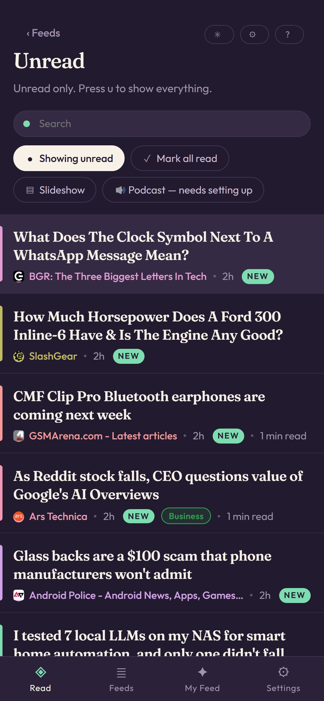</td>
<td width="33%">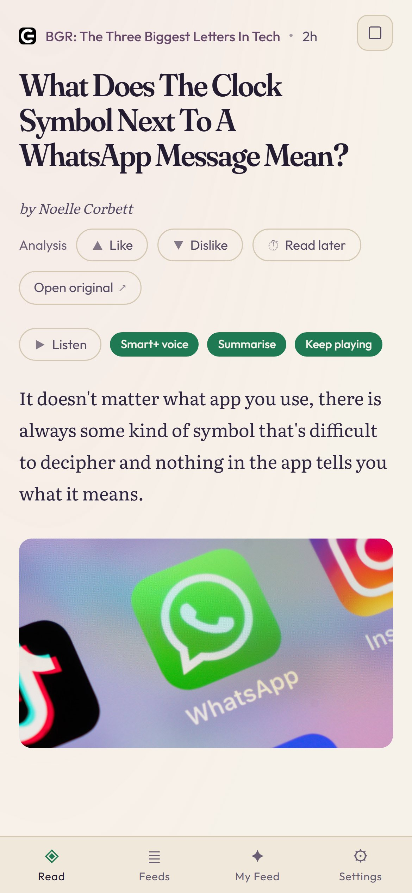</td>
<td width="33%">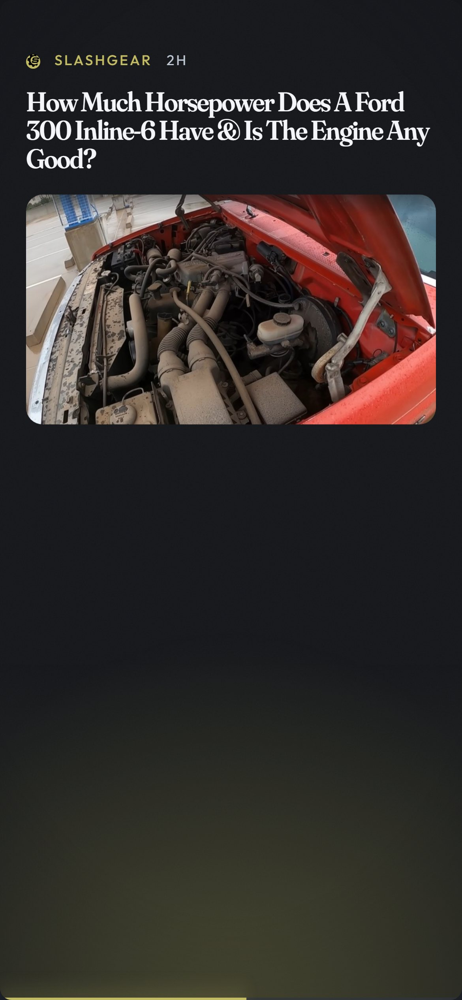</td>
</tr>
<tr>
<td align="center"><em>Four tabs, one pane at a time.<br><strong>Fanciful</strong></em></td>
<td align="center"><em>The chip row, and the voice controls.<br><strong>Daylight</strong></em></td>
<td align="center"><em>The slideshow, playing.<br><strong>Ink</strong></em></td>
</tr>
</table>

Below 1220px the panes become a strip — rail, list, article, in the order they are already in — so
**deeper moves left, back moves right**, the same as a stack of paper.

---

## Sixty seconds to a running reader

```powershell
./scripts/make.ps1 build
./bin/articleflux.exe seed    # subscribe to a starter set and fetch it
./scripts/make.ps1 dev    # http://127.0.0.1:9000
```

```powershell
./scripts/make.ps1 dev      # build the client and serve it
./scripts/make.ps1 e2e      # Playwright, desktop + phone, against a real server
./scripts/make.ps1 test     # go test ./...
./scripts/make.ps1 lint     # go vet, buf lint, and the five structural guards
./scripts/make.ps1 demo     # the static demo into bin/demo (see docs/DEMO.md)
```

`dev` serves the local account with **no login** — the client asks the server at boot and goes
straight to the reader, no password prompt. It is refused on any bind but loopback, and refused
alongside `-behind-proxy`. `cp .env.example .env` documents the same switch as `ARTICLEFLUX_DEV=1`,
along with the dev credentials (`cam` / `articleflux-dev`) for when you want to exercise the login
screen itself — and on a loopback origin the login screen prefills both fields with them, so it is
one click.

On Linux the same verbs exist as a `Makefile` — `make dev`, `make test`, `make lint`. The two are
kept identical on purpose; two build systems is only a lie if they disagree.

No Node for the app. No Docker. No WSL. Node appears exactly once, in the e2e suite, because
Playwright drives a real browser.

---

## Putting it on a server

**[`deploy/README.md`](deploy/README.md)** takes a bare Ubuntu droplet to a reader on TLS in about
twenty minutes: systemd unit, nginx site with the WebSocket settings the tunnel needs, certbot,
and a nightly verified backup. Ships with it:

| | |
|---|---|
| [`deploy/articleflux.service`](deploy/articleflux.service) | Hardened systemd unit — loopback bind, unprivileged user, `ProtectSystem=strict` |
| [`deploy/nginx.conf`](deploy/nginx.conf) | The `/grpc` block, whose four settings are the difference between a working tunnel and one that drops every sixty seconds |
| [`deploy/install.sh`](deploy/install.sh) · [`update.sh`](deploy/update.sh) · [`rollback.sh`](deploy/rollback.sh) · [`diagnose.sh`](deploy/diagnose.sh) | The lifecycle, as scripts rather than as a runbook nobody re-reads. A release is a directory behind a symlink, so a rollback is an atomic swap |
| [`deploy/articleflux-health.{service,timer}`](deploy/) | The watchdog — and a failed deploy exits non-zero, so the hook records it as a failure instead of a success |
| [`deploy/articleflux-backup.{service,timer}`](deploy/) | `VACUUM INTO` + `PRAGMA integrity_check` nightly, because a `cp` of a WAL-mode database restores cleanly and is silently missing a transaction |
| [`deploy/deployhook`](deploy/deployhook) | Deploys **when CI goes green**, not when someone pushes |

A hosted instance requires a login. Create the first account from the browser — an unclaimed
instance answers with a setup screen rather than a login screen, it can be claimed exactly once, and
it will not let you skip the recovery codes — or from the command line:

```bash
articleflux init -db /var/lib/articleflux/articleflux.db -user cam
```

The server refuses to start rather than serving a login screen nobody can get past — along with
two other boot checks (missing web root, unwritable data directory) that otherwise surface hours
later while `/healthz` reports green.

<p align="center">
  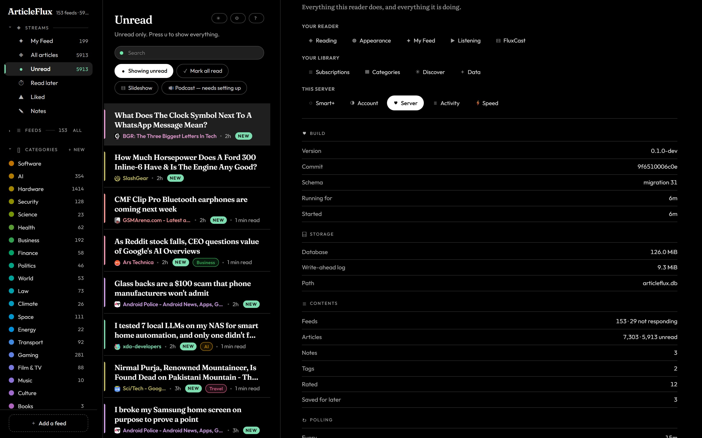
</p>

<p align="center"><em>The Server tab, in <strong>Contrast</strong>. What a self-hosted application owes
its operator: the commit it is running, the schema version, how big the database actually is, how
many feeds have stopped responding, and when it last polled — in the reader, not in a log file.</em></p>

---

## Built on two libraries worth stealing

ArticleFlux is the proof that these two work together on something real, and it is small enough to read.
If you only take one thing from this repository, take one of these.

### GoWebComponents — the UI is Go

**[github.com/monstercameron/GoWebComponents](https://github.com/monstercameron/GoWebComponents)**

A Go + WebAssembly UI framework with a React-shaped component model: hooks, a fiber runtime, typed
HTML builders, client-side routing, shared state, streaming SSR with hydration, crash containment,
i18n, PWA support — all in one Go module.

The part that changes how a project feels is **the CSS engine**. Styles are Go values, compile-checked,
colocated with the component:

```go
css.Rule(".row",
    css.Custom("--c", css.Var("hue")),
    css.BorderLeft("3px solid", css.Var("c")),
    css.Media("(max-width: 720px)", css.Padding("0.5rem")),
)
```

There is **not one `.css` file in this repository**, and CI fails if one appears. There is not one
application `.js` file either. The stylesheet, the layout, the interaction and the state are the same
language as the query planner — which means a rename is a compiler error rather than a bug report,
and a designer's change lands in `client/design/sheet.go` next to the component it styles.

> **What it costs, honestly:** the wasm bundle is 32.9 MB, roughly 7 MB gzipped, and CI fails the
> build if it grows more than 5% without someone bumping `wasm-baseline.txt` on purpose. That is the
> trade: a large first load, cached thereafter, in exchange for deleting an entire toolchain.
> ArticleFlux decided the trade was worth it and made the Service Worker load-bearing. Decide it
> yourself before adopting — the framework's README says the same thing.

### GoGRPCBridge — the wire is real gRPC

**[github.com/monstercameron/GoGRPCBridge](https://github.com/monstercameron/GoGRPCBridge)**

Browsers cannot open raw TCP sockets, so a standard gRPC client does not work in a `js/wasm` build.
The usual answer is to give up and write a REST layer — hand-rolled JSON on both sides, drifting
silently, with the contract living in a wiki page.

GoGRPCBridge tunnels HTTP/2 gRPC frames over a WebSocket instead:

```text
Browser (Go WASM gRPC client)
  └─ WebSocket
       └─ grpctunnel bridge handler (net/http)
            └─ HTTP/2 ⇄ in-process grpc.Server
                 └─ your existing protobuf services
```

Your `.proto` files do not change. Your generated clients do not change. Server integration is
`grpctunnel.Wrap(grpcServer)`, which is an `http.Handler`. All four RPC types work — unary,
server-streaming, client-streaming, bidirectional — plus deadlines, metadata and interceptors. It
ships origin allowlists, pre-upgrade authorization, connection caps, keepalive with transparent
reconnection, OpenTelemetry spans, and a native-transport mode that is 47% lighter on memory per RPC.

In ArticleFlux this is what the `connected` dot in the toolbar reports, and it is why the client and the
server cannot disagree about a field name: **`proto/articleflux/v1` is the only contract, and both ends
are generated from it.** Sixty RPCs across five services — and the streaming half is no longer
theoretical: `WatchEvents` is what makes an item arriving on the server appear on the screen without
a refresh, and `GetAudioTrack` streams the broadcast's music down the same tunnel.

---

## How it is put together

```
cmd/articleflux    one binary: serve · init · adduser · passwd · migrate · backup
                   seed · poll · fluxcast · import · export · version
internal/store     ALL SQL lives here. Two pools: many readers, one writer
internal/feed      fetch + normalise. Every fetch goes through the SSRF guard
internal/reader    the service layer — one place that knows what "mark read" means
internal/transport gRPC, thin: message translation and the error taxonomy
internal/smart     the model tier — classification, themes, summaries, broadcast prose
internal/fluxcast  the editorial producer: clusters, airtime, running order
client/            the wasm app. design/ (tokens + stylesheet), view/, data/, platform/
proto/             the contract all transports share
```

Four decisions shape most of the code:

- **Sources and items are global and deduplicated.** One popular feed is polled once no matter how
  many people subscribe. That is why read/star state lives in its own table, and why global rows are
  never hard-deleted — a cascade from `items` would destroy every other tenant's history.
- **Two connection pools.** SQLite allows many readers and exactly one writer; modelling that as two
  pools makes the constraint structural instead of a race.
- **All CSS is Go.** There is no `.css` file in this repository and CI fails if one appears.
- **`syscall/js` lives in exactly one package**, so every other client package compiles — and is
  testable — natively.

**Each is enforced by a guard in `internal/tools/guards`, not by convention** — five of them now: no
SQL outside `store`, no `syscall/js` outside `platform`, no `.css` files, no inline copy outside the
i18n catalogs, and every exported method on a `*Repo` takes a `store.Scope`, so tenant isolation is
checked structurally rather than by a reviewer noticing a missing parameter. A decision that is only
written down is a decision that erodes; a decision with a build failure attached is a decision.

## Tested

| | |
|---|---|
| Go tests | 317 test files across 85 packages, run on Windows in CI; a package-by-package sweep put statement coverage above 90% across ~40 of them |
| e2e | 27 Playwright specs, desktop **and** phone, against a real server and a real database |
| Design parity | the palette, three type stacks, and one hue reaching all four surfaces, checked mechanically |
| Structural guards | five, all green, run on every push |
| Contract | `buf lint` plus `buf breaking` — additive-only within v1, because old clients exist in the wild |
| Bundle size | ratcheted against a checked-in baseline; +5% fails the build |
| Fuzzing | 21 targets across 14 packages — feed parsing, charset decoding, mail headers, URL normalisation, the SSRF guard, and the HTML sanitizer |

CI also excludes a handful of **named known-red tests from the gate and then runs them again,
non-blocking, so they stay visible.** A pin exists to stay visible; silencing one at the source
decides a product question that is not the silencer's to decide.

## The documents

`plan.md` is the spec of record, `TODO.md` the dependency-ordered build, `FLOWS.md` the nine paths
that are easy to get subtly wrong, [`docs/FEATURES.md`](docs/FEATURES.md) the behaviour of every
capability and whether it exists yet, [`AGENTS.md`](AGENTS.md) the router that says which of them
answers which question, and `design/` the visual specification (hand-written HTML that nobody ports
— the reader is rebuilt from it in Go).

They are kept in sync with the code deliberately, and the precedence rule is written down: **if the
implementation contradicts `plan.md`, the plan is wrong, and it gets corrected in the same change.**
A spec that has quietly drifted is worse than no spec, because it still gets trusted.

Start at `TODO.md` Tier 9, where every milestone has a complete brief: the plan sections that define
it, the pages, the components, the flow diagram, and the tests that must go green.

## Notes for anyone picking this up

- **GoWebComponents v5 is tagged now (`v5.0.1`)** and CI pins that tag — but `go.mod` still carries a
  `replace` to a sibling checkout for local work, so `../GoWebComponents` has to exist next to this
  repo. Note that v5.0.0 shadows `html`'s shorthands with `css/u`; anything dot-importing both needs
  `>= v5.0.1`.
- **FTS5 is not compiled into `ncruces/go-sqlite3`.** It is a loadable extension that must be
  registered on every connection — see `internal/store.Open`. There is a permanent test for this, so
  a dependency bump that drops FTS5 fails the build instead of silently removing search.
- **`go build ./...` does not compile the client, and `go test ./...` does not test `client/view`.**
  The wasm packages are behind `//go:build js` and a native build skips them entirely; `client/view`
  is `js && wasm` with zero untagged files and runs under Node in the `wasmtest` job. A green native
  build has proved nothing about the thing people actually load.
- **`Props.Style` cannot set CSS custom properties** in GWC — it assigns JS properties, and that path
  does not reach `--vars`. Use a style *string* through `Raw`. This silently rendered every hue grey
  and no test that did not open a browser could see it.
- **A `func(string)` event handler receives `event.target.value`**, not the key — so search-on-Enter
  silently never fired.
- **The dev server runs without a login**, and only ever on a loopback bind. Binding a real interface
  turns that off, because an internet-facing instance with it on would be an open reader.

## Contributing

Read [CONTRIBUTING.md](CONTRIBUTING.md) first — the doc discipline and the "when the spec is silent"
rule are the whole culture of this repository, and they are short.

## Licence

MIT. See [LICENSE](LICENSE).
